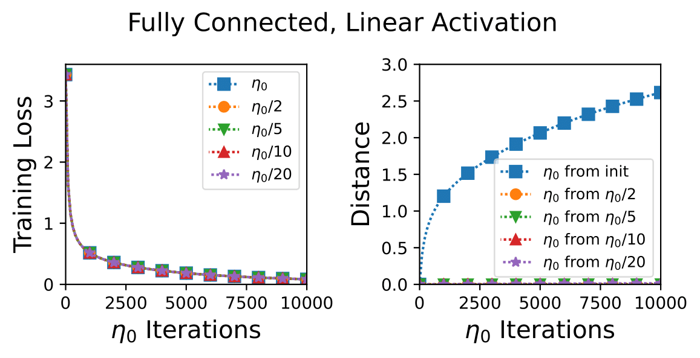

# Continuous vs. Discrete Optimization of Deep Neural Networks

Code, based on the PyTorch framework, for reproducing the experiments in [Continuous vs. Discrete Optimization of Deep Neural Networks](https://arxiv.org/abs/2107.06608).

## Install Requirements
Tested with python 3.9.2
```
pip install -r requirements.txt
```
- To enable cuda (GPU) to speed up the running time, install pytorch version 1.8.1 with CUDA compatible to your system from [here](https://pytorch.org/get-started/locally/).


## Running the experiments

The following command runs an experiment and plots the resulting graph (in this specific example we run the experiment with the fully connected linear model):
```
python experiment_runner.py \
--experiment "fully_connected_linear" \
--epochs 10000 \
--learning_rate 0.001
```

- The ```experiment``` run argument should refer to one of the following models "fully_connected_linear" or "fully_connected_relu" or "conv_subsample" or "conv_maxpool".

## Example of plot

For the example above we get the following plot:

<p align="center">

</p>


## Citation
For citing the paper, you can use:
```
@article{elkabetz2021continuous,
  title={Continuous vs. Discrete Optimization of Deep Neural Networks},
  author={Elkabetz, Omer and Cohen, Nadav},
  journal={arXiv preprint arXiv:2107.06608},
  year={2021}
}
```
